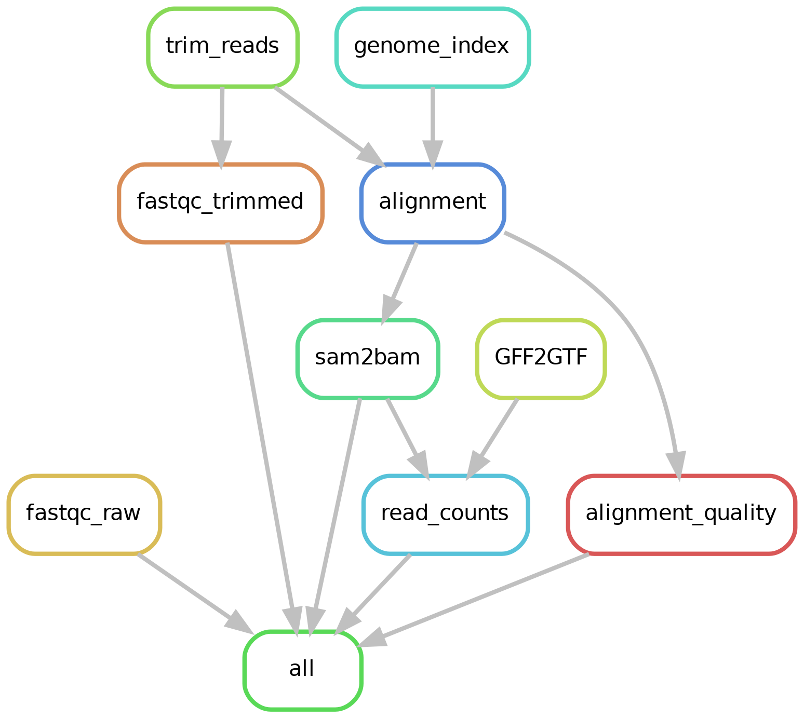

# PGRP-Grape-Grafting

## Set up your environment
```bash
bash setup.sh
```

Alternatively,
```bash
conda env create -f environment.yml
conda activate pgrp-grape
```

> Note: If you are using Ohio Super Computer (OSC), please run the following to set up environment
> ```bash
> module load python/3.6
> bash setup_osc.sh
> ```

## Running (dry-run)
```bash
snakemake -n --configfile config.json
```

## Create Rules' Graph
```bash
snakemake --rulegraph --configfile config.json | dot -Tpng -Gdpi=300 > images/rule-graph.png
```



## Create Directed Acyclic Graph (DAG)
```bash
snakemake --dag --configfile config.json | dot -Tpng -Gdpi=300 > images/dag.png
```

## Download Reference Genome
The helper script called `download.genome.py`, can be used to download a reference genome, it only needs a JSON file with the following format:
```bash
{
  "VvChar04_v1.fasta":
    "http://169.237.73.197/Chardonnay04/downloads/VvChar04_v1.fasta",
  "VvChar04_v1.gff3":
    "http://169.237.73.197/Chardonnay04/downloads/VvChar04_v1.gff3"
}
```

```bash
python download.genome.py genomes/vitis-vinifera-cv-chardonnay.json
```

## HPC cluster execution
### South Dakota State University: Roaring Thunder
```bash
snakemake -j JOBS  \ # maximum number of simultaneous jobs to spawn
	  --configfile config.json # configuration file
          --latency-wait 1000 \ # files latency in seconds
          --cluster-config cluster.sdsu.json \ # cluster configuration file
          --cluster "sbatch --job-name={cluster.name} 
                            --nodes={cluster.nodes} 
                            --ntasks-per-node={cluster.ntasks} 
                            --output={cluster.log} 
                            --partition={cluster.partition} 
                            --time={cluster.time}"
``` 

### Extra
To backup the conda environment, the following command can be executed:
```bash
conda env export | grep -v "^prefix: " > environment.yml
```
